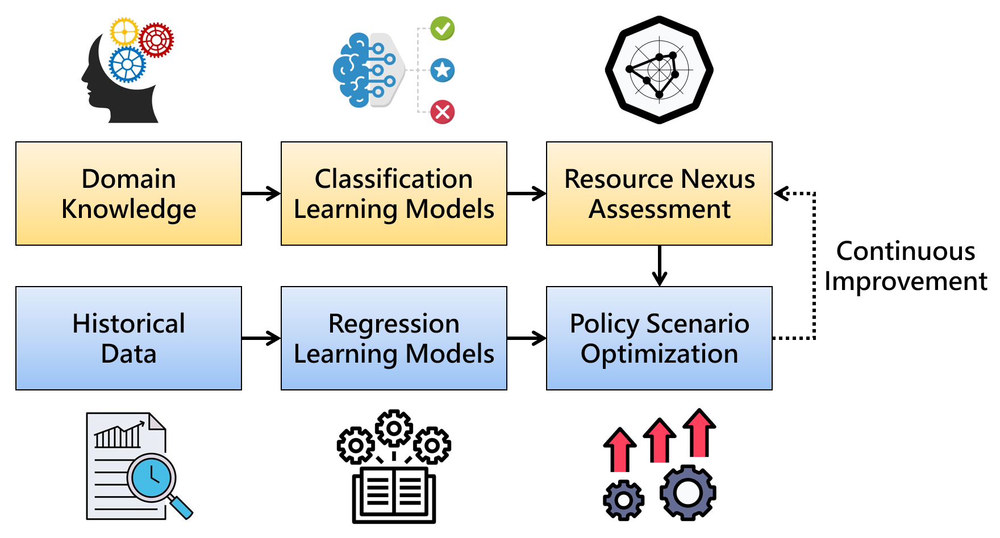

# WEFN
Assessing the Water-Energy-Food Nexus with Machine Learning Models

The purpose of this research is not only to introduce machine learning models to the field of environmental issues, but also to provide a paradigm for improving policy decisions over time.

