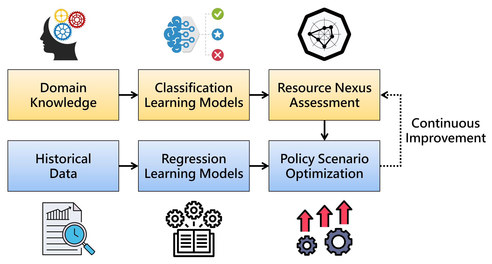

# Assessing the Water-Energy-Food Nexus with Machine Learning Models

This is the code for the WEFN project [publication link].

The purpose of this research is not only to introduce machine learning models to the field of environmental issues, but also to provide a paradigm for improving policy decisions over time.

# Instructions
## Step 1: Classification Model Evaluation

## Step 2: Resource Nexus Assessment

## Step 3: Regression Model Evaluation

## Step 4: Policy Scenario Optimization

